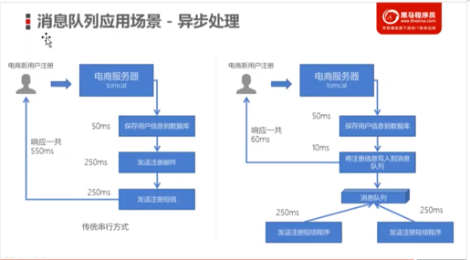
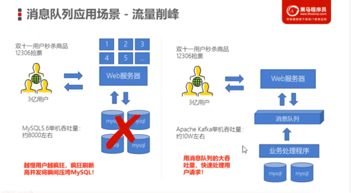
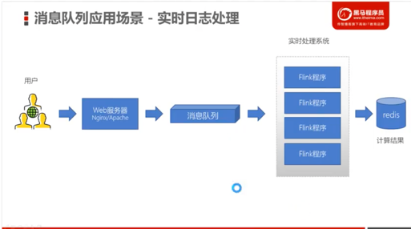
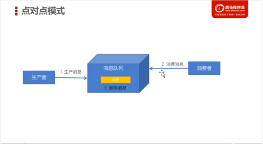
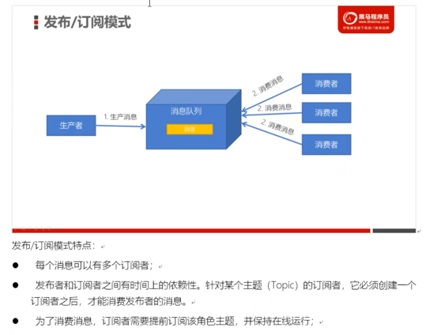
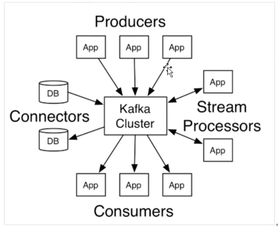

## kafka
### 1 消息队列简介

##### 1.1  特性
    - 高吞吐量、低延迟：每秒可以处理几十万条消息，延迟最低只有几毫秒，每个主题可以分多个分区，消费组对分区进行消费操作
    - 可扩展性：kafka支持集群热扩展
    - 持久性、可靠性：消息被持久化到本地磁盘，并支持数据备份防止数据丢失
    - 容错性：允许集群中节点失败（若副本数量为N，则允许N-1个节点失败）
    - 高并发：支持数千个客户端同时读写

##### 1.2 应用场景
    - 异步处理（耗时操作）

    - 系统解耦

    - 流量削峰（低延迟、高可靠、高可用，可以应对大量并发）

    - 日志处理（大数据领域，用于临时存储、通信管道）

##### 1.3 消息队列两种模式
    - 生产者、消费者模型
      - 生产者负责将消息生产到MQ中
      - 消费者负责从MQ中获取消息
      - 生产者和消费者是解耦的，没有依赖性
    - 点对点

    - 发布/订阅

### 2 Kafka 简介

##### 2.1 特性
    Apache Kafka 是一个分布式的流平台。一个分布式的流平台应该包含3个关键的能力： 
    - Publish/Subscribe：发布/订阅流数据流，类似于消息队列
    - Store：以容错的持久化方式存储数据
    - Process：处理数据流

##### 2.1 Kafka 应用场景
    - 建立实时数据管道，以可靠的在系统或应用之间获取数据
    - 构建实时流应用程序，以转换或响应数据流

 
#####1 Zookeeper 在 Kafka 中的实际作用是什么？如果我不同时使用 Zookeeper 和 Kafka，我会错过什么好处？
    
    Kafka 将 Zookeeper 用于以下用途：
    选举控制器。控制器是broker之一，负责维护所有分区的leader/follower关系。当一个节点关闭时，控制器会告诉其他副本成为分区领导者，以替换即将离开的节点上的分区领导者。Zookeeper 用于选举一个控制器，确保只有一个控制器，如果它崩溃，则选择一个新的控制器。
    集群成员 - 哪些代理还活着并且是集群的一部分？这也是通过 ZooKeeper 管理的。
    主题配置 - 存在哪些主题，每个主题有多少个分区，副本在哪里，谁是首选领导者，为每个主题设置了哪些配置覆盖
    (0.9.0) - 配额 - 每个客户端允许读取和写入多少数据
    (0.9.0) - ACLs - 谁可以读写哪个主题
    （旧的高级消费者） - 存在哪些消费者组，他们的成员是谁以及每个组从每个分区获得的最新偏移量是多少。
    我认为这涵盖了它:)
    最后一个用例是唯一一个正在消失的用例。

