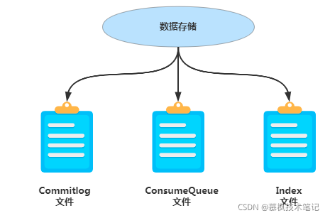

## MQ
#### 1 简介
    - MQ，Message Queue——消息队列，保存消息的容器。
#### 2 特点
    - 先进先出
    - 发布订阅
    - 持久化
    - 分布式

## RocketMQ
###1 简介
####1.1 特性
######RcoketMQ 是一款低延迟、高可靠、可伸缩、易于使用的消息中间件。具有以下特性：

    
    - 支持发布/订阅（Pub/Sub）和点对点（P2P）消息模型
    - 在一个队列中可靠的先进先出（FIFO）和严格的顺序传递
    - 支持拉（pull）和推（push）两种消息模式
    - 单一队列百万消息的堆积能力
    - 支持多种消息协议，如 JMS、MQTT 等
    - 分布式高可用的部署架构,满足至少一次消息传递语义
    - 提供 docker 镜像用于隔离测试和云集群部署
    - 提供配置、指标和监控等功能丰富的 Dashboard（仪表盘）

####1.2 RocketMQ 存储结构
######https://blog.nowcoder.net/n/152d8b0760e743249812139c50c8807a?from=nowcoder_improve
    RocketMQ对应的存储文件主要包括三类：
    - Commitlog文件
    - ConsumeQueue文件
    - Index文件

    
    rocketmq为了保证高性能，主要有以下三个原因
    1.顺序写
    顺序写比随机写的性能会高很多，不会有大量寻址的过程
    2.异步刷盘
    相比较于同步刷盘，异步刷盘的性能会高很多
    3.零拷贝
    使用mmap的方式进行零拷贝，提高了数据传输的效率

    - 文件存储机制：RocketMq采用文件系统存储消息，采用顺序写的方式写入消息，使用零拷贝发送消息，这三者的结合极大地保证了RocketMq的性能

####1.3 主要组成 及 执行流程

    - NameServer
      由多个无状态的节点构成，节点之间无任何信息同步。broker会定期向NameServer以发送心跳包的方式，轮询向所有NameServer注册以下元数据信息：
      broker的基本信息（ip port等）、主题topic的地址信息、broker集群信息、存活的broker信息、filter 过滤器。
      也就是说，每个NameServer注册的信息都是一样的。
    - Broker
      消息中转角色，负责存储消息、转发消息。
    - Producer
      负责生产消息。RocketMQ提供了多种发送方式，同步发送、异步发送、顺序发送、单向发送。同步和异步方式均需要Broker返回确认信息，单向发送不需要。
    - Cosumer
      负责消费消息。一般是后台系统负责异步消费。拉取式消费、推动式消费。

    Step1：Producer向Broker端发送Half Message；
    Step2：Broker ACK，Half Message发送成功；
    Step3：Producer执行本地事务；
    Step4：本地事务完毕，根据事务的状态，Producer向Broker发送二次确认消息，确认该Half Message的Commit或者Rollback状态。
           Broker收到二次确认消息后，对于Commit状态，则直接发送到Consumer端执行消费逻辑，而对于Rollback则直接标记为失败，
           一段时间后清除，并不会发给Consumer。正常情况下，到此分布式事务已经完成，剩下要处理的就是超时问题，
           即一段时间后Broker仍没有收到Producer的二次确认消息；
    Step5：针对超时状态，Broker主动向Producer发起消息回查；
    Step6：Producer处理回查消息，返回对应的本地事务的执行结果；
    Step7：Broker针对回查消息的结果，执行Commit或Rollback操作，同Step4。
  
###2.RocketMQ 安装及配置

    # 启动命令，并且常驻内存，nohup 属于后台启动，当前目录下生成 nohup.out 日志文件，也可以指定日志输出位置。
    2.1 启动namesrv
    # sh bin/mqnamesrv ：属于终端启动，直接输出日志信息，按 ctrl+c 可直接关闭退出
    $ nohup sh bin/mqnamesrv &
    # 查看启动日志，能看到 "The Name Server boot success" 字样则成功
    $ tail -f ~/logs/rocketmqlogs/namesrv.log
    #看到 “ The Name Server boot success. serializeType=JSON ” 表示启动成功
    
    2.2 启动broker
    nohup sh bin/mqbroker -n localhost:9876 &
    sh bin/mqbroker -n localhost:9876 ：属于终端启动，直接输出日志信息，按 ctrl+c 可直接关闭退出
    tail -f ~/logs/rocketmqlogs/broker.log
    #看到 "The broker[%s, 172.30.30.233:10911] boot success..." ,则表示启动成功
  
    2.3 关闭broker
    sh bin/mqshutdown broker
    The mqbroker(36695) is running...
    Send shutdown request to mqbroker(36695) OK
    
    2.4 关闭namesrv
    sh bin/mqshutdown namesrv
    The mqnamesrv(36664) is running...
    Send shutdown request to mqnamesrv(36664) OK

    2.5 常用命令
    --查看集群情况	
    ./bin//mqadmin clusterList -n 127.0.0.1:9876
    --查看 broker 状态
    ./bin/mqadmin brokerStatus -n 127.0.0.1:9876 -b 172.20.1.138:10911
    --查看 topic 列表
    ./bin/mqadmin topicList -n 127.0.0.1:9876
    --查看 topic 状态
    ./bin/mqadmin topicStatus -n 127.0.0.1:9876 -t MyTopic (换成想查询的 topic)
    --查看 topic 路由
    ./bin/mqadmin topicRoute -n 127.0.0.1:9876 -t MyTopic

###3.常见面试题
>https://blog.csdn.net/u012998254/article/details/114710123?utm_medium=distribute.pc_relevant.none-task-blog-2~default~baidujs_baidulandingword~default-0-114710123-blog-118978969.pc_relevant_default&spm=1001.2101.3001.4242.1&utm_relevant_index=2

####3.1 部署方式
    - 单Master
    - 多Master多Slave模式，异步复制
      优点：较高的吞吐量。                                         缺点：毫秒级的延迟；若Master宕机、磁盘损坏，存在少量消息丢失的情况。
    - 多Master多Slave模式，同步双写
      优点：Master宕机情况下，消息无延迟，服务可用性与数据可用性都非常高。缺点就是：降低消息写入的效率，并影响系统的吞吐量。

####3.2 Consumer 重复消费问题
    只要通过网络交换数据，就无法避免因为网络不可靠而造成的消息重复这个问题。
    比如说RocketMq中，当consumer消费完消息后，因为网络问题未及时发送ack到broker,broker就不会删掉当前已经消费过的消息，
    那么，该消息将会被重复投递给消费者去消费。虽然rocketMq保证了同一个消费组只能消费一次，但会被不同的消费组重复消费，
    因此这种重复消费的情况不可避免。
    措施：
    - 建立一张日志表，使用消息主键作为表的主键，在处理消息前，先insert表，再做消息处理。这样可以避免消息重复消费

####3.* 消息丢失
    - 重试机制  
    - 定期重发

