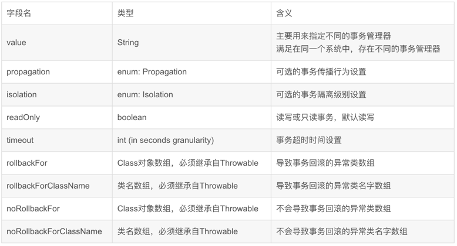

## 1 Spring
####1 IOC

    1.1 概念
    - IOC （Inversion Of Control 意为 控制反转），将对象的创建、管理及对象之间的依赖关系，交给Spring容器进行管理。目的是解耦合。
    1.2 底层原理
    - XML解析、工厂模式、反射
    
    1.3 IOC容器
    - IOC容器具有依赖注入功能的容器，负责实例化、定位、配置应用程序中的对象并建立这些对象之间的依赖，IOC底层就是对象工厂；
    - Spring提供IOC容器的两种实现方式：
       - BeanFactory
       IOC容器基本实现方式 ，是Spring内部使用的接口。加载配置文件时不会创建对象，在调用getBean("")方法时才会创建对象；
       - ApplicationContext
       BeanFactory子接口，提供更多更强大的功能。加载配置文件时，会将配置的所有对象进行创建。
    
    1.4 IOC操作 Bean管理（控制反转 & 依赖注入）
    - 基于XML创建对象
       - Bean标签、id 唯一标识、class 类的全路径
       - 创建对象时，默认调用类的无参构造
    
    - 基于XML属性注入
       - DI（Dependency Injection）：依赖注入。容器可以通过set() 或者 构造器 来建立对象之间的依赖关系。
       - set方法注入
          - Bean标签内部，property标签，name（类属性名），value（待注入属性值）
       - 有参构造注入 
          - Bean标签内部，constructor-arg标签，name（类属性名），value（待注入属性值）
   
    - 基于注解创建对象
       - 引入依赖、开启组件扫描（细节配置）、添加注解 @Component(value="")、@Controller(value="")、@Service(value="")、@Repository(value="")
    
    - 基于注解属性注入
       - @Autowired(required = "false")：根据属性类型进行自动装配，允许为null
       - @Qualifier(value="")：根据属性名称进行自动装配，需要与@Autowired一起使用；
       - @Resource(name="")：根据属性类型、属性名称进行自动装配；
       - @Value：普通类型属性进行注入
    
    - 完全注解开发
       - 创建配置类，替代xml配置文件；
       - @Configuration
         @ComponentScan(basePackages={""})

####2 AOP（Aspect Oriented Programming ）

    2.1 概念
    - AOP（Aspect Oriented Programming ），面向切面编程,即: 不用修改源代码就可以扩展功能；

    2.2 底层原理（通过动态代理来实现）
      a.JDK动态代理，只能代理有接口类
      Proxy：返回指定接口的代理类的实例
      b.cglib动态代，只能代理无接口类
    
    2.3 术语：
    a.连接点
    - 类中所有可以被增强的方法
    b.切入点
    - 实际被增强的方法
    c.通知（增强）
    - 增强的逻辑部分
    - 通知有五种类型
      - Around
      - Before（前置通知：在目标方法执行前执行）
      - After（后置通知：在目标方法执行后执行，无论方法是否执行成功）
      - AfterReturnning（返回通知：在目标方法返回后执行，执行成功之后）
      - AfterThrowing（异常通知：在目标方法抛异常时执行）
    d.切面
    - 动作，把通知应用到切入点的过程
 
     2.4 AOP 操作
     a.Spring框架一般都是基于AspectJ实现AOP操作；
     - AspectJ：独立的AOP框架
     
     b.基于AspectJ实现AOP操作
     - 基于XML配置
     - 基于注解
       - @Component｜@Aspect、@Pointcut、@Before...
       - 切入点表达式
          execution([权限修饰符][返回值类型][类全路径][方法名称]([参数列表])) 
       - @Pointcut  提取公共切入点
       - 有多个增强类对同一个方法进行增强，设置增强类的优先级。在增强类上添加注解@Order(0/1/2/3/4)，值越小优先级越高
     
     - 基于完全注解开发的 AOP配置
~~~java
       /**
        * 可自动为所有标注 @Aspect 的类创建代理对象 
        * 注意：proxyTargetClass: true 使用CGLIB代理无接口类；
        *                        false默认值，使用JDK代理有接口类。
        */
       @Configuration
       @ComponentScan(basePackages = "com.zhuzs.admin")
       // 表示开启AOP代理自动配置；表示使用cglid进行代理对象的生成；表示通过aop框架暴露该代理对象；
       @EnableAspectJAutoProxy(proxyTargetClass = true) 
       public class AopConfig {
       }
~~~~

 
   
####3 常用注解

    3.1 @Controller：用于标注控制器层组件
    3.2 @Service：用于标注业务层组件
    3.3 @Component : 用于标注这是一个受 Spring 管理的组件，组件引用名称是类名，第一个字母小写。
        可以使用@Component(“beanID”) 指定组件的名称
    3.4 @Repository：用于标注数据访问组件，即DAO组件
    3.5 @Bean：方法级别的注解，主要用在@Configuration和@Component注解的类里，@Bean注解的方法会产生一个Bean对象，
        该对象由Spring管理并放到IoC容器中。引用名称是方法名，也可以用@Bean(name = "beanID")指定组件名
    3.6 @Scope("prototype")：将组件的范围设置为原型的（即多例）。保证每一个请求有一个单独的action来处理，避免action的线程问题。
        由于Spring默认是单例的，只会创建一个action对象，每次访问都是同一个对象，容易产生并发问题，数据不安全。
    3.7 @Autowired：默认按类型进行自动装配。在容器查找匹配的Bean，当有且仅有一个匹配的Bean时，Spring将其注入@Autowired标注的变量中。
    3.8 @Resource：默认按名称进行自动装配，当找不到与名称匹配的Bean时会按类型装配。

####4 事务 @Transactional
https://blog.csdn.net/baidu_38083619/article/details/106085287

######4.1 简介
    @Transaction 是 Spring 提供用来控制事务回滚/提交的一个注解，让我们从编程式注解转换到声明式注解。
######4.2 作用域
    @Transaction 可以写在类、接口、方法上

    当标注在类上的时候：表示给该类所有的 public 方法添加上 @Transaction 注解。
    当标注在接口上的时候：Spring 建议不要在接口或者接口方法上使用该注解，因为这只有在使用基于接口的代理时它才会生效。
                      像 CGLib 动态代理采用继承的方式将会导致 @Transactional 注解失效。
 
    当标注在方法上的时候：事务的作用域就只在该方法上生效，并且如果类及方法上都配置 @Transaction 注解时，方法的注解会覆盖类上的注解。

######4.3 @Transactional 属性

