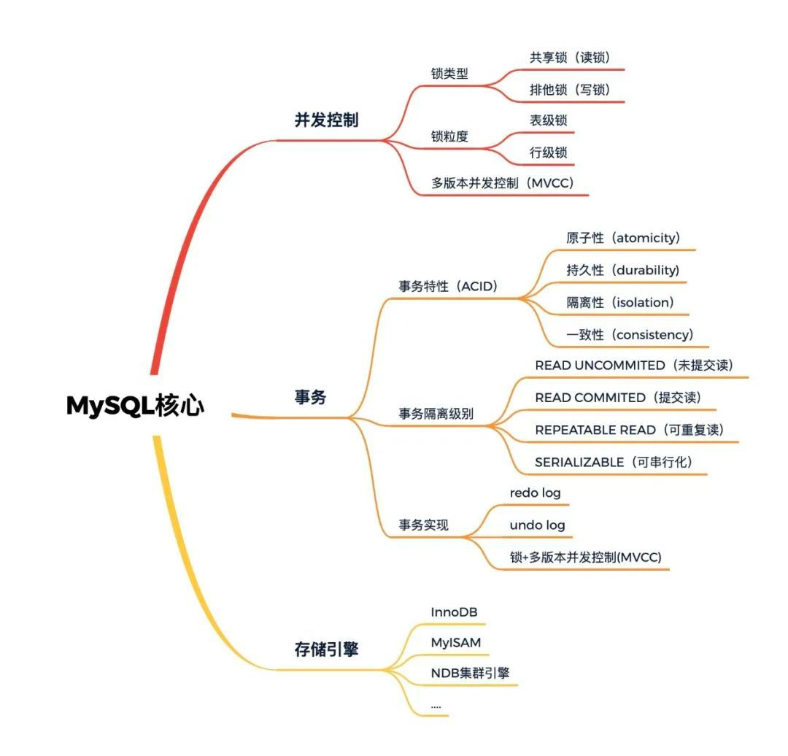
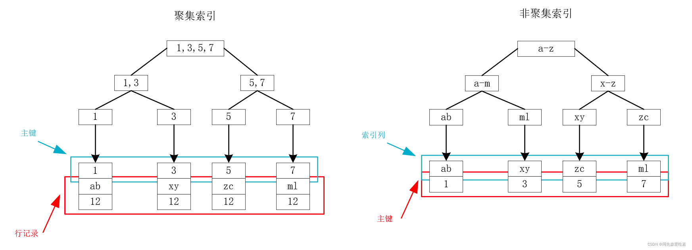
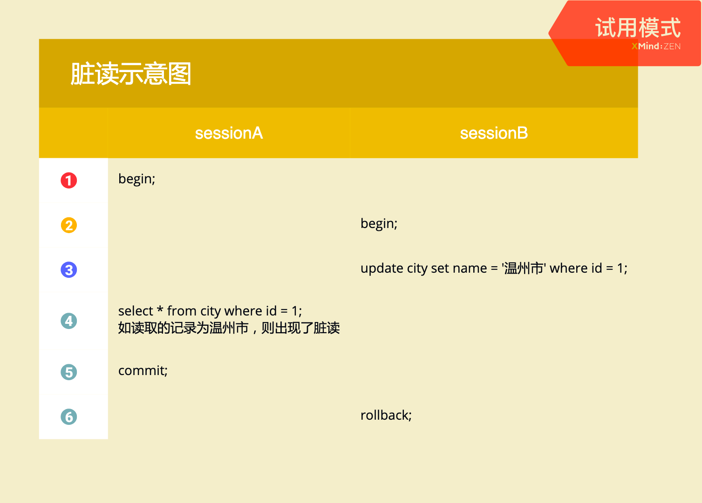
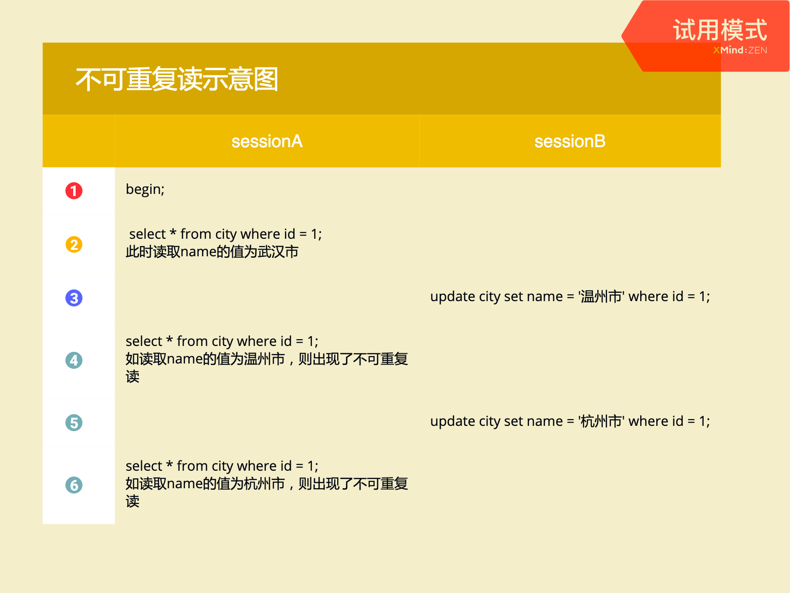

## MYSQL

#### 1.简介
######1.1 查询数据库隔离级别：
    - SELECT @@transaction_isolation; ——> REPEATABLE-READ 

######1.2 MVCC(MultiVersion Concurrency Control 多版本并发控制)
https://cloud.tencent.com/developer/article/1877099#

    - Record Lock：锁定一个记录上的索引，而不是记录本身。如果表没有设置索引，InnoDB 会自动在主键上创建隐藏的聚簇索引，
      因此 Record Locks依然可以使用。
    - Gap Lock：间隙锁，锁定一个范围，但不包括记录本身。GAP锁的目的，是为了防止同一事务的两次当前读，出现幻读的情况。
    - Next-Key Lock：1、2组合，锁定一个范围，并且锁定记录本身。对于行的查询，都是采用该方法，主要目的是解决幻读的问题。

######1.3 最左匹配原则
https://blog.csdn.net/zhouchen1998/article/details/124672991

######1.4 聚集索引和非聚集索引
https://www.cnblogs.com/cangqinglang/p/15042752.html （索引-B+树）

    - MySQL底层使用B+树来存储索引，数据均存在叶子节点上。对于InnoDB而言，主键索引和行记录时存储在一起的，因此叫做聚集索引（clustered index）。
      除了聚集索引，其他所有都叫做非聚集索引（secondary index），包括普通索引、唯一索引等。
    - 在InnoDB中，只存在一个聚集索引：
      若表存在主键，则主键索引就是聚集索引；
      若表不存在主键，则会把第一个非空的唯一索引作为聚集索引；
      否则，会隐式定义一个rowid作为聚集索引。
    - 我们以下图为例，假设现在有一个表，存在id、name、age三个字段，其中id为主键，因此id为聚集索引，name建立索引为非聚集索引。
      关于id和name的索引，有如下的B+树，可以看到，聚集索引的叶子节点存储的是主键和行记录，非聚集索引的叶子节点存储的是主键。

    

#######1.5回表查询
    - 从上面的索引存储结构来看，我们可以看到，在主键索引树上，通过主键就可以一次性查出我们所需要的数据，速度很快。
      这很直观，因为主键就和行记录存储在一起，定位到了主键就定位到了所要找的包含所有字段的记录。
    - 但是对于非聚集索引，如上面的右图，我们可以看到，需要先根据name所在的索引树找到对应主键，
      然后通过主键索引树查询到所要的记录，这个过程叫做回表查询。

######1.6索引覆盖
    - 上面的回表查询无疑会降低查询的效率，那么有没有办法让它不回表呢？这就是索引覆盖。
      所谓索引覆盖，就是说，在使用这个索引查询时，使它的索引树的叶子节点上的数据可以覆盖你查询的所有字段，就可以避免回表了。
      我们回到一开始的例子，我们建立的(b,c,d)的联合索引，因此当我们查询的字段在b、c、d中的时候，就不会回表，只需要查看一次索引树，这就是索引覆盖。

######1.7最左匹配原则
    - 指的是联合索引中，优先走最左边列的索引。对于多个字段的联合索引，也同理。
      如 index(a,b,c) 联合索引，则相当于创建了 a 单列索引，(a,b)联合索引，和(a,b,c)联合索引。

#### 2.数据库优化

    a.使用索引
    - LIKE 关键字使用'%'开头的字符串,不会使用索引，应避免;
    - 建立联合索引，使用时应遵循最左匹配原则
    b.增加冗余字段
    c.大量连接查询，创建中间表
    d.优化子查询：
    - 使用JOIN来代替子查询.因为子查询需要嵌套查询,嵌套查询时会建立一张临时表,临时表的建立和删除都会有较大的系统开销,
      而连接查询不会创建临时表,因此效率比嵌套子查询高
    

#### 3.常见面试题

###### 3.1 主键索引和唯一性索引的区别

     - 主键一定是唯一性索引，唯一性索引并不一定是主键；
     - 主键只能存在一个，唯一性索引能存在多个；
     - 主键列不允许空值，而唯一性索引列允许空值

###### 3.2 数据库事务

     首先，MySQL 中只有使用了 Innodb 数据库引擎的数据库或表才支持事务。四大特性如下：
     - Atomicity（原子性）
     - Consistency（一致性）
     - Isolation（隔离性）
     - Durability（持久性）

     SQL 标准定义了四个隔离级别：
     - read-uncommitted(读取未提交): 可能会导致脏读、不可重复读、幻读
     - read-committed(读取已提交)  : 可以阻止脏读，可能会导致不可重复读、幻读
     - repeatable-read(可重复读)   : 可以阻止脏读和不可重复读，但幻读仍有可能发生
     - serializable(可串行化)      : 事务顺序执行，完全服从 ACID 的隔离级别，最高的隔离级别

     事务控制语句：
     BEGIN——>COMMIT/ROLLBACK
     
     事务并发可能出现的情况:

     

###### 3.3 分库分表
     存在的问题：
     - 事务问题
     - 跨节点关联查询join问题
     - 跨节点分页、排序、函数问题
     - 全局主键避重问题
     - 数据迁移、扩容问题

###### 3.4 深度分页

###### 3.5 InnoDB 和 MyISAM 的区别
     - MyISAM是非事务安全的，而InnoDB是事务安全的
     - MyISAM锁的粒度是表级的，而InnoDB支持行级锁
     - MyISAM支持全文类型索引，而InnoDB不支持全文索引
     - MyISAM相对简单，效率上要优于InnoDB，小型应用可以考虑使用MyISAM
     - MyISAM表保存成文件形式，跨平台使用更加方便

     应用场景：
     - MyISAM管理非事务表，提供高速存储和检索以及全文搜索能力，如果再应用中执行大量select操作，应该选择MyISAM
     - InnoDB用于事务处理，具有ACID事务支持等特性，如果在应用中执行大量insert和update操作，应该选择InnoDB
