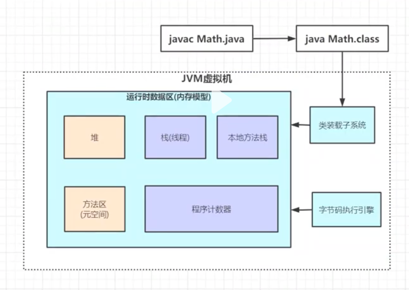
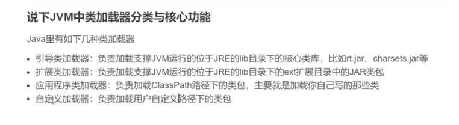
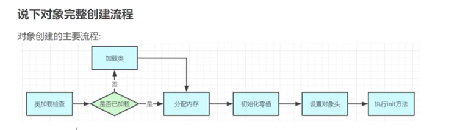
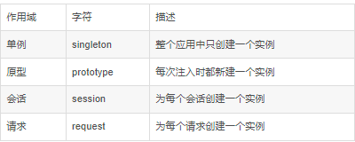
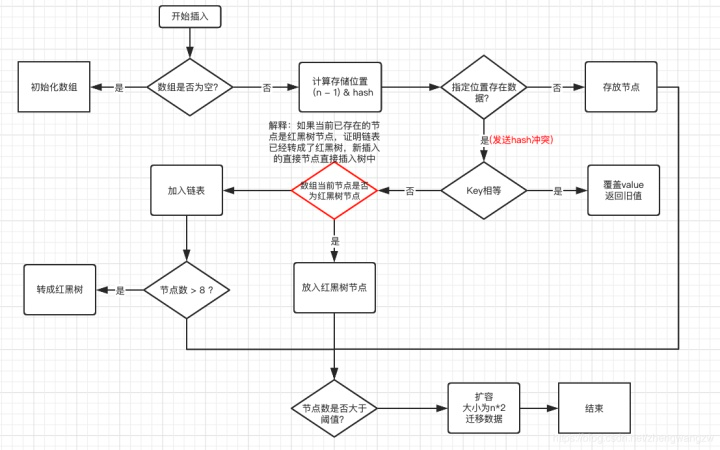

## 1 Java 基础

#### 1.1 反射(动态代理) 及 javassit

###### 示例：zhuzsdemo.aop.jdkproxy

###### 1.1.1 Java反射机制 概述

###### 1.1.2 Javassit 概述

    - Reflection 是Java被视为动态语言的关键。反射机制允许程序在执行期借助于Reflection API
      取得任何类的内部信息，并能直接操作任意对象的内部属性及方法。
    - 加载完类之后，在堆内存的方法区中就产生了一个Class类型的对象（一个类只有一个Class对象），
      这个对象包含了完整的类的结构信息。
    优点：
        可以实现动态创建对象和编译，灵活性大；
    缺点：
        反射是一种解释性操作，耗性能；

    1.2 理解Class类并获取Class实例 
    - Class 本身也是一个类
    - Class对象只能由系统建立
    - 一个加载的类在JVM中只会有一个Class实例
    - 一个Class对象对应的是一个加载到JVM中的.class文件
    - 每个类的实例都会记得自己是由哪个Class实例所生成
    - 通过Class可以完整地得到一个类中的所有被加载的结构；
    - Class类是Reflection的根源，针对任何你想动态加载、运行的类，唯有先获得相应的Class对象
    
    1.3 Class创建方式
    - Class c1 = ClassObject.class;
    - Class c2 = object.getClass();
    - Class c3 = Class.forName("cn.javaguide.TargetObject");
    - Class c4 = ClassLoad.loadClass("cn.javaguide.TargetObject");

#### 1.2 注解

    1.Annotation 是从JDK5.0开始引入的新技术
    2.Annotation 的作用
    - 不是程序本身，可以对程序做出解释；
    - 可以被其他程序（比如：编译器等）读取
    3.Annotation在哪里使用
    - package、class、method、filed等，相当于给他们添加了一些额外的辅助信息，
      我们可以通过反射机制实现对这些元素的访问。 
    4.元注解
      负责注解其他注解，即用来对其他annotation类型作说明。（java.lang.annotation包）
    - @Target：指定注解的作用范围（ElementType）；
    - @Retention：指定注解的生命周期（RetentionPolicy：保留策略 runtime > class > sources）
    - @Documented：说明该注解将被包含在 Javadoc 中；
    - @Inherited：子类可以继承父类的该注解；
    
    5.自定义注解
    - @interface 

##### 1.3 事务

##### 1.4 JVM（Java Virtual Machine）

###### 1.4.1 JVM 组成部分

    - 栈(线程栈)：
      栈帧：一个方法对应一块栈帧内存区域
      - 局部变量表
    - 堆：

###### 1.4.2 JVM 中类加载器及其核心功能

###### 1.4.3 JVM 双亲委派机制

    - 沙箱安全机制：防止核心API库被篡改
    - 避免累的重复加载：当父加载器已经加载过了某类时，就无需子加载器再加载一次。保证被加载类的唯一性。

###### 1.4.4 Tomcat 为何打破双亲委派机制

    - 不同的应用程序引用了第三方不同版本的jar，要保证每个应用程序的类库都是独立的。

###### 1.4.5 对象完整的创建流程

##### 1.5 Spring 创建的Bean作用域都有哪些？默认是哪一个？

    - 默认是单例 singleton 
    - 常见面试题：创建单例的方式是否线程安全与使用已经创建好的单例对象是否线程安全是两个问题 
      - 常见创建单例的方式：懒汉式、饿汉式、静态内部类
    - 在spring的框架里，对象是交给spring容器创建的，
      spring的创建单例的方式既不是懒汉式也不是饿汉式，是单例注册表模式实现单例模式的，详见：
      https://blog.csdn.net/u012794505/article/details/80926823
    - 怎么判断使用已经创建好的单例对象是否线程安全:
      - 看这个单例里有没有全局变量（全局变量就是成员变量，成员变量又分实例变量和静态变量）
      - 如果有全局变量，看它是不是只可以读取而不能写入（有没有发布set方法）

~~~java

// 懒汉式（不安全写法）
public class Singleton {
    private Singleton() {
    }

    //不建立对象
    private static Singleton singleton = null;

    public static Singleton getInstance() {
        //先判断是否为空
        if (singleton == null) {
            //懒汉式做法
            singleton = new Singleton();
        }
        return singleton;
    }
}

// 饿汉式
public class Singleton {
    public Singleton() {
    }

    //建立对象
    private static Singleton singleton = new Singleton();

    public static Singleton getInstance() {
        //直接返回单例对象 
        return singleton;
    }
}

// 懒汉式（安全写法 双重检查）
public class Singleton {
    private Singleton() {
    }

    //不建立对象
    private static Singleton singleton = null;

    public static Singleton getInstance() {
        //先判断是否为空
        if (singleton == null) {
            synchronized (Singleton.class) {
                if (singleton == null) {
                    //懒汉式做法 
                    singleton = new Singleton();
                }
            }
        }
        return singleton;
    }
}

/**
 * 枚举单例
 */
private enum Singleton {
    /**
     * 枚举实例，该实例天生为单例
     */
    INSTANCE;
    private final ScheduledThreadPoolFactory instance;
    Singleton() {
        instance = new ScheduledThreadPoolFactory();
    }
}

~~~

#### 1.6 concurrent 线程安全类
##### 1.6.1 ConcurrentHashMap 底层原理
    - JDK1.7 采用了头插法，JDK1.8采用尾插法
    - 1.7 -> 1.8 ，从 ReentrantLock+Segment（分段锁）+HashEntry，到JDK1.8版本中synchronized+CAS+HashEntry+红黑树
    - HashMap中没有取余运算，而是用与（&）操作 + 扰动机制（hashCode值右移+异或运算，让高位的值参与运算）

#### 1.7 ThreadLocal 原理

    - 为每个线程提供一个独立的变量副本解决了变量并发访问的冲突问题
    - 可以将类变量放到ThreadLocal类型的对象中，使变量在每个线程中都有独立拷贝，
      不会出现一个线程读取变量时而被另一个线程修改的现象。最常见的ThreadLocal使用场景为用来解决数据库连接、Session管理等。

## 2 Java8 新特性

#### 2.1 函数式编程 和 Lambda- 表达式

    - 函数式编程，可以使用极简的lambda表达式实例化接口
    - lambda表达式，是实现函数式接口的一个快捷方式

#### 2.2 java.time
~~~java
   // 计算两时间点 相差的时、分、秒
    LocalDateTime startTime = charg.getChagStartDate().toInstant().atZone(ZoneId.systemDefault()).toLocalDateTime();
    LocalDateTime endTime = charg.getChagEndDate().toInstant().atZone(ZoneId.systemDefault()).toLocalDateTime();
    Duration duration = Duration.between(startTime, endTime);
    long hours = duration.toHours();
    long minutes = duration.toMinutes();
    long second = 0 == duration.toMillis() ? 0 : duration.toMillis() / 1000;
~~~

#### 2.3 Optional类

    - Optional 类是一个可以为null的容器对象。如果值存在则isPresent()方法会返回true，调用get()方法会返回该对象。
      Optional 是个容器：它可以保存类型T的值，或者仅仅保存null。Optional提供很多有用的方法，这样我们就不用显式进行空值检测。
      Optional 类的引入很好的解决空指针异常。
   
    - Stream流有一些特性：
       1.Stream流不是一种数据结构，不保存数据，它只是在原数据集上定义了一组操作。
       2.这些操作是惰性的，即每当访问到流中的一个元素，才会在此元素上执行这一系列操作。
       3.Stream不保存数据，故每个Stream流只能使用一次。
   
       2个概念:
       流、管道。元素流在管道中经过中间操作的处理，最后由最终操作得到前面处理的结果。

       2个操作:
       中间操作：返回结果都是Stream，故可以多个中间操作叠加。
       终止操作：用于返回我们最终需要的数据，只能有一个终止操作。
   
       使用Stream流，可以清楚地知道我们要对一个数据集做何种操作，可读性强。
       而且可以很轻松地获取并行化Stream流，不用自己编写多线程代码，可以更加专注于业务逻辑。
       默认情况下，从有序集合、生成器、迭代器产生的流或者通过调用Stream.sorted产生的流都是有序流，
       有序流在并行处理时会在处理完成之后恢复原顺序。
       无限流的存在，侧面说明了流是惰性的，即每当用到一个元素时，才会在这个元素上执行这一系列操作。

       使用Stream的基本步骤：
       1.创建Stream
       2.转换Stream，每次转换原有Stream对象不改变，返回一个新的Stream对象（可以有多次转换）
       3.对Stream进行聚合操作，获取想要的结果

##### 2.4 Base64

##### 2.5 接口的默认方法和静态方法

##### 2.6 新增Stream类

    - Stream把真正的函数式编程风格引入到Java中，可以让你以一种声明的方式处理数据。
    - Stream API极大简化了集合框架的处理，这种风格将要处理的元素集合看作一种流， 
      流在管道中传输， 并且可以在管道的节点上进行处理， 比如筛选， 排序，聚合等。

##### 2.7 注解相关

    - Java 5引入了注解机制，Java 8引入了重复注解机制。
    - 几乎可以为任何东西添加注解：局部变量、泛型类、父类与接口的实现，就连方法的异常也能添加注解。

##### 2.8 支持并行（parallel）数组

##### 2.9 对并发类（Concurrency）的扩展

##### 2.10 方法引用

