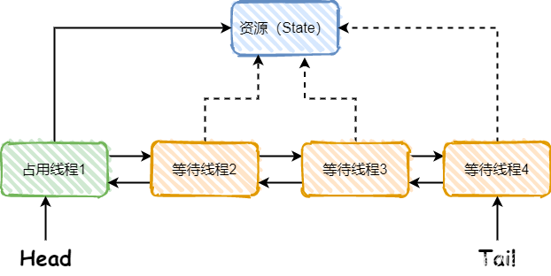

## Java锁机制
   - Synchronized
   - Lock
###### 解决多线程的并发安全问题，java无非就是加锁：java中synchronized和ReentrantLock都是可重入锁
#### 1.Synchronized 隐式锁、悲观锁、非公平锁
    a.作用
    - synchronized 它可以把任意一个非 NULL 的对象当作锁。他属于独占式的悲观锁，同时属于可重入锁。
    - synchronized 关键字解决的是多个线程之间访问资源的同步性，
      synchronized 关键字可以保证被它修饰的方法或者代码块在任意时刻只能有一个线程执行。

    b.java自带的关键字,JVM层面的锁 
    - 同步代码块 synchronized 
    - 同步方法(静态方法、实例方法) synchronized 

    c.总结： 
    - synchronized 关键字加到 静态方法和 代码块 上都是是给 Class 类上锁。
    - synchronized 关键字加到实例方法上是给对象实例上锁。
      尽量不要使用 synchronized(String a) 因为JVM中，字符串常量池具有缓存功能

    d.构造方法可以使用 synchronized 关键字修饰么？
    - 只有涉及资源共享的时候才考虑线程安全问题，即使多个线程同时构造同一个类的对象，它们各自构造的对象之间也是互不相干的，不存在共享资源。
      其他线程是不可能调用还没有实例化好的对象的。所以给构造函数加synchronized关键字是没有什么意义的。 
      但是如果在构造函数内部确实有读写共享资源（如静态变量），这时仍然需要对相关的资源进行同步，依具体情况而定（锁定代码块）。

#### 2.Lock 显示锁 公平/非公平锁
    jdk1.5以后，可重入锁java.util.concurrent.locks包下有两个接口，分别对应两个类实现了这个两个接口 

    a.lock接口(API层面的锁), 实现的类为：ReentrantLock类 可重入锁、独占锁
    - 除了能完成 synchronized 所能完成的所有工作外，
      还提供了：可响应中断锁、可轮询锁请求、定时锁等避免多线程死锁的方法

    b.java.util.concurrent.locks.ReadWriteLock 接口，实现类为：ReentrantReadWriteLock 读写锁
    - 读写锁分为读锁和写锁，多个读锁不互斥，读锁与写锁互斥，这是由 jvm 自己控制的，你只要上好相应的锁即可。
      读锁：如果你的代码只读数据，可以很多人同时读，但不能同时写，那就上读锁；
      写锁：如果你的代码修改数据，只能有一个人在写，且不能同时读取，那就上写锁。

    也就是说有三种：
    （1）synchronized 是互斥锁；
    （2）ReentrantLock 顾名思义 ：可重入锁
    （3）ReentrantReadWriteLock :读写锁

#### 3.隐式和显式锁对比：：
    - synchronized是一个内置的Java关键字，ReentrantLock是一个类，实现了Lock接口
    - synchronized会自动加锁或释放锁，ReentrantLock需要手动加锁和释放锁
    - synchronized 无法判断获取锁的状态，ReentrantLock 可以判断是否获取到了锁
    - synchronized底层是JVM层面的锁，ReentrantLock是API层面的锁
    - synchronized是可重入锁，非公平锁，ReentrantLock是可重入锁，可以选择公平锁和非公平锁
    - synchronized锁的是对象，锁信息保存在对象头中，ReentrantLock锁的线程，通过代码中int类型的state标识来标识锁的状态
    - 相比synchronized，ReentrantLock增加了一些高级功能。（等待可中断、可实现公平锁、可实现选择性通知）

#### 4.AQS

###### a.什么是AQS
    - AQS的全称是AbstractQueuedSynchronizer，是一个用来构建锁和同步器的框架，
      像ReentrantLock，Semaphore，FutureTask都是基于AQS实现的。
    - AQS的工作流程：AQS会维护一个共享资源，当被请求的共享资源空闲，则将请求资源的线程设为有效的工作线程，同时锁定共享资源。
      如果被请求的资源已经被占用了，AQS就用过队列实现了一套线程阻塞等待以及唤醒时锁分配的机制。

    - 从图中可以看出AQS维护了一个共享资源和一个FIFO的线程等待队列。
      这个队列是通过CLH队列实现的，该队列是一个双向队列，有Node结点组成，
      每个Node结点维护一个prev引用和next引用，这两个引用分别指向自己结点的前驱结点和后继结点，
      同时AQS还维护两个指针Head和Tail，分别指向队列的头部和尾部。

###### b.AQS的底层使用了模板方法模式，自定义同步器只需要两步：
    - 继承AbstractQueuedSynchronizer;
    - 重写以下几种方法：
      isHeldExclusively()：该线程是否正在独占资源。只有用到condition才需要去实现它。
      tryAcquire(int)：独占方式，尝试获取资源。
      tryRelease(int)：独占方式，尝试释放资源。
      tryAcquireShared(int)：共享方式，尝试获取资源。负数表示失败，0表示成功，但无剩余可用资源，正数表示成功并且有剩余资源
      tryReleaseShared(int)：共享方式，尝试释放资源

    - 独占式的ReentrantLock实现方式：
      state初始状态为0，表示未锁定状态。A线程进行lock()时，会调用tryAcquire()独占该锁并将state+1。
      此后，其他线程再调用tryAcquire()时就会失败，直到A线程unlock()到state=0（即释放锁）为止，其它线程才有机会获取该锁。
      当然，释放锁之前，A线程自己是可以重复获取此锁的（state会累加），这就是可重入的概念。
      但要注意，获取多少次就要释放多么次，这样才能保证state是能回到零态的。
    
    - 共享式的CountDownLatch实现方式：任务分为N个子线程去执行，state也初始化为N（注意N要与线程个数一致）。
      这N个子线程是并行执行的，每个子线程执行完后countDown()一次，state会CAS减1。
      等到所有子线程都执行完后(即state=0)，会unpark()主调用线程，然后主调用线程就会从await()函数返回，继续后余动作。
    
    - 一般来说，自定义同步器要么是独占方法，要么是共享方式，他们也只需实现tryAcquire-tryRelease、
      tryAcquireShared-tryReleaseShared中的一种即可。但AQS也支持自定义同步器同时实现独占和共享两种方式，如ReentrantReadWriteLock。

##### 3.乐观锁 和 悲观锁
##### a.乐观锁：
     - 一种乐观思想，即认为读多写少，遇到并发写的可能性低，每次去拿数据的时候都认为别人不会修改，所以不会上锁，
       但是在更新的时候会判断一下在此期间别人有没有去更新这个数据，采取在写时先读出当前版本号，
       然后加锁操作（比较跟上一次的版本号，如果一样则更新），如果失败则要重复读-比较-写的操作。
     - java 中的乐观锁基本都是通过 CAS 操作实现的，CAS 是一种更新的原子操作，比较当前值跟传入值是否一样，一样则更新，否则失败。

##### b.悲观锁：
     - 一种悲观思想，即认为写多，遇到并发写的可能性高，每次去拿数据的时候都认为别人会修改，所以每次在读写数据的时候都会上锁，
       这样别人想读写这个数据就会 block 直到拿到锁。java中的悲观锁就是synchronized；

