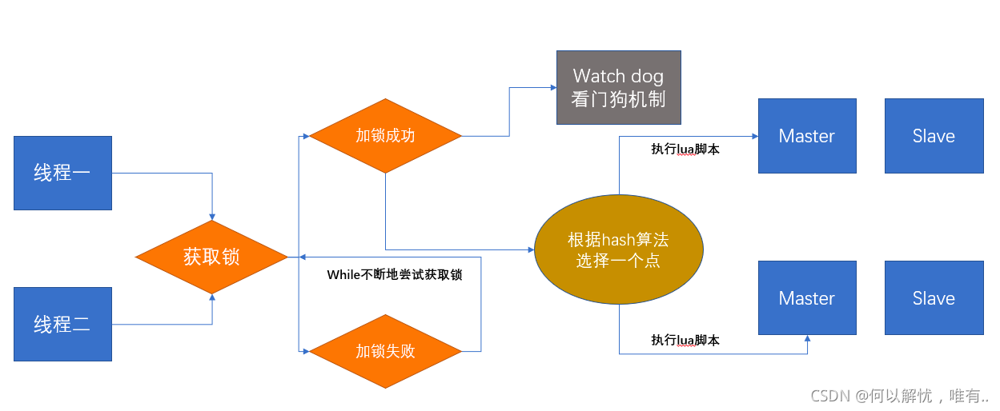
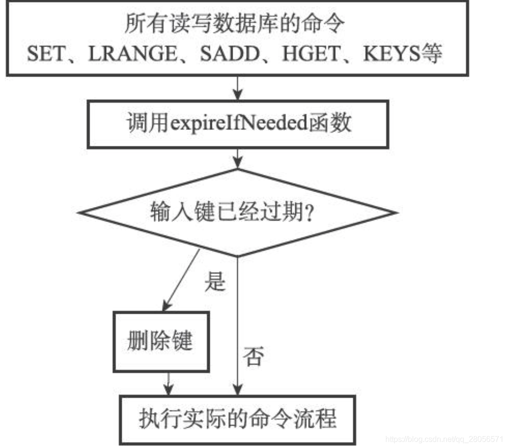
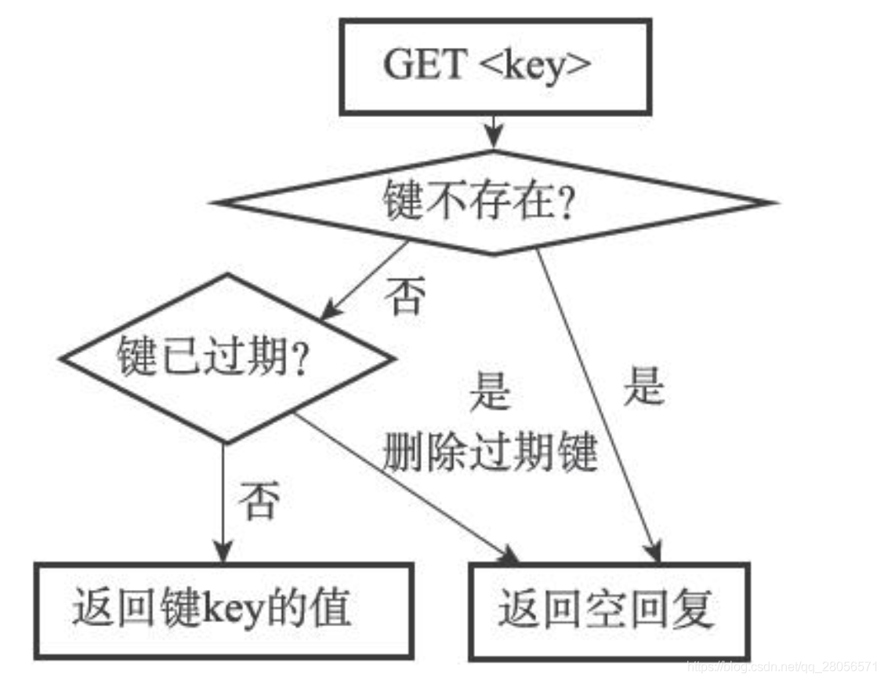
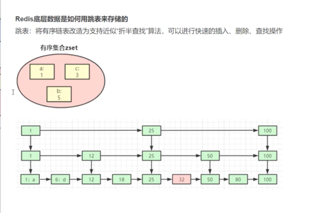
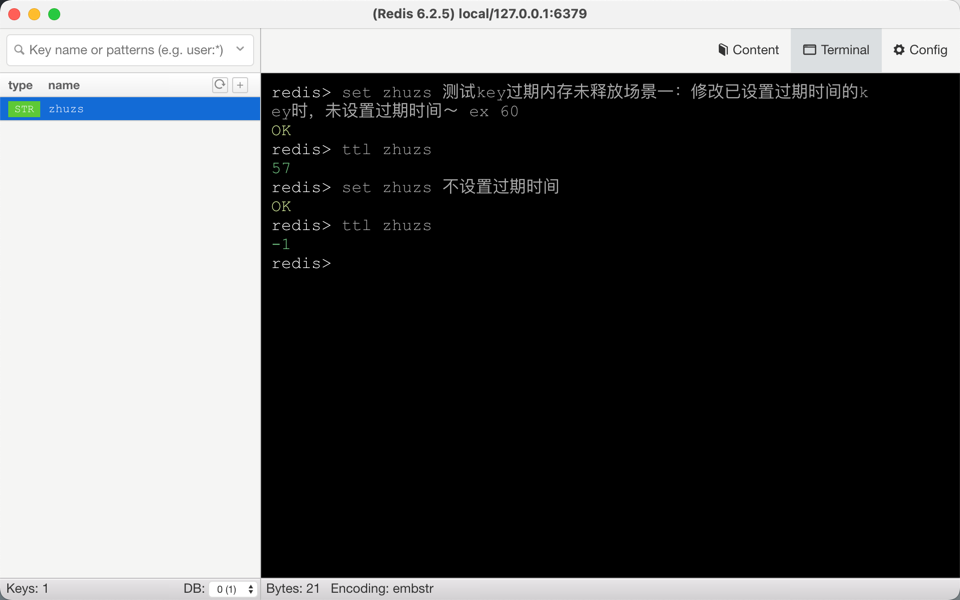

## Redis
####1.简介及背景
######1.1 什么是NoSQL
    NoSQL=Not Only SQL（不仅仅是SQL）
    NoSQL 特点：高扩展性、高性能、数据类型多样性
######1.2 概述
    - Redis(Remote Dictionary Server)，即远程字典服务
    - Redis 是一个开源的，内存中的数据结构存储系统，可以用作数据库、缓存和消息中间件。支持的数据类型有：
      字符串（string）， 散列（hashe）， 列表（list）， 集合（set）， 有序集合（zset）
    
    特点：
    - 丰富的数据类型支持复杂的应用场景
    - 支持数据持久化
      - RDB：将Redis某一时刻存在的所有数据都写入硬盘。
      - AOF：AOF的全称叫append-only file，中文意思是只追加文件。
    - 支持事务，操作都是原子性。
    - 支持集群模式
    - 在服务器内存使用完之后，可以将不用的数据放到磁盘上（一般会设置过期时间），
      而如 Memcached 在服务器内存使用完之后，就会直接报异常。
####2.缓存
####3.分布式锁 
######3.1 底层原理

 
    - 加锁机制
    - 锁互斥机制
    - watch dog自动延期机制
    - 可重入加锁机制
    - 释放锁机制
######3.2 Redis 分布式锁的最大缺陷
    - 在 Redis Cluster、Redis Master-Slave 主从架构中，
      Redis Master 实例宕机的时候，可能导致多个客户端同时完成加锁

######3.3 RedLock 的优化措施
    - 顺序向五个节点请求加锁
    - 根据一定的超时时间来推断是不是跳过该节点
    - 三个节点加锁成功并且花费时间小于锁的有效期
    - 认定加锁成功
https://www.jianshu.com/p/7e47a4503b87

####4.常见面试题

######4.1 过期键删除策略
    Redis 实际采用的是 惰性删除+定期删除
    - 惰性删除：只有从dict中取出键时，才会对键进行过期检查。
    - 定期删除：每隔一段时间执行一次删除过期键的操作（默认100ms,每次检查最大时长250ms），通过限制删除操作执行时长和频率来减少删除操作对CPU时间的影响。

    - 每隔一段时间对redisServer中的所有redisDb的expires依次进行随机抽取检查。
    - redis中有一个server.hz定义了每秒钟执行定期删除的次数，每次执行的时间为250ms/server.hz。
    - redis中会维护一个current_db变量来标志当前检查的数据库。current_db++，当超过数据库的数量的时候，会重新从0开始。
    - 定期检查就是执行一个循环，循环中的每轮操作会从current_db对应的数据库中随机依次取出w个key，查看其是否过期。如果过期就将其删除， 
      并且记录删除的key的个数。如果过期的key个数大于w25%，就会继续检查当前数据库，当过期的key小于w25%，会继续检查下一个数据库。
    - 当执行时间超过规定的最大执行时间的时候，会退出检查。
    - 一次检查中可以检查多个数据库，但是最多检查数量是redisServer中的数据库个数，也就是最多只能从当前位置检查一圈。
  

    - 逐出策略
      Redis 在执行每一条命令前，都会调用freeMemoryIfNeeded()检测内存是否充足，如果内存不满足要加入数据的最低要求，
      redis会临时删除一些数据为当前指令清理存储空间。清理数据的策略称为逐出算法。

######4.2 雪崩、击穿、穿透
    - 雪崩：大批量热点数据缓存失效，如：全盘宕机、key设置相通过期时间，大量请求渗透到数据库层，引起数据库压力造成查询堵塞甚至宕机。
      解决方案：分布式锁、哨兵模式、设置过期时间加上随机数
    - 击穿：某个热点数据失效，且大量请求涌入，直接请求数据库。
      解决方案：设置key永不过期、分布式锁setnx
    - 穿透：大量请求不存缓存的数据（恶意攻击场景），直接请求数据库，严重造成数据库宕机。
      解决方案：非法参数校验、Boolm Filter、缓存空数据并设置较短的过期时间

######4.3 Redis 中的数据与数据库中的数据不一致
    - 延时双删策略
      首先删除缓存中的数据，更新mysql数据，延迟500毫秒，再一次删除缓存中的数据。

######4.4 Redis6.0 多线程是指代？
    - 网络请求过程采用了多线程（利用CPU的多核），而健值对读写命令仍是单线程处理的，所以Redis依然是并发安全的。

######4.5 Redis 为什么这么块？
    - 命令执行基于内存操作
    - 命令是单线程操作，没有线程切换开销
    - 基于 I/O 多路复用机制提升Redis I/O 利用率
    - 高效的数据存储结构：全局Hash表及多种高效数据结构，如：跳表、压缩列表、链表等

######4.6 Redis 底层是如何用跳表来存储数据的？
    - 跳表：将有序链表改造为支持近似"折半查找"算法，可以进行快速的插入、删除、查找操作。

######4.7 Redis Key过期了为什么没有释放内存？
    - 修改已设置过期时间的key时，未设置过期时间

