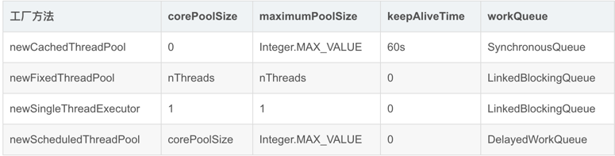
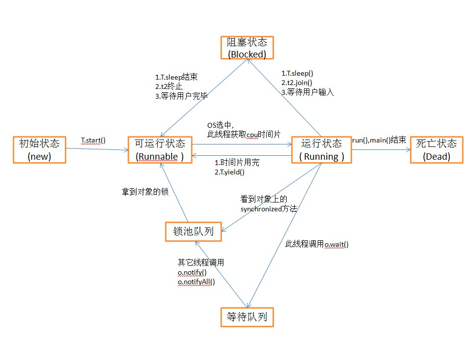

## 多线程
#### 1.相关概念 
###### 1.1 串行、并行、并发的区别
    串行：串行在时间上不可能发生重叠，前一个任务没有执行结束，下一个任务就不会开始
    并行：并行在时间上是重叠的，两个任务在同一时刻互不干扰的同时执行
    并发：多个任务在同一个 CPU 核上，按细分的时间片轮流(交替)执行，同一时间点，只有一个任务执行，任务交替执行

###### 1.2 并发编程三要素
    原子性：一个操作是不可分割的，要么全部执行成功要么全部执行失败。
    可见性：一个线程对共享变量的值进行修改后，另一个线程能够立刻看到修改的值。（synchronized,volatile）
    有序性：程序执行的顺序按照代码的先后顺序执行。（处理器可能会对指令进行指令重排）
    指令重排：虚拟机在进行代码编译时，对于那些改变顺序后不会对最终结果造成影响的代码，
             虚拟机不一定会按照我们写的代码顺序来执行，有可能将他们重排序。
            实际上对有些代码进行重排序后，虽然对变量的值没有造成影响，但有可能出现线程安全问题。

###### 1.3 并发编程特点
    优点：提升多核CPU的利用率，方便进行业务拆分。提高了程序的执行效率，一定情况下可以提高程序运行速度。
    缺点：可能出现内存泄漏、上下文切换、线程安全、死锁等问题。

###### 1.4 什么是线程和进程?两者的区别是什么？
    进程：程序的⼀次执⾏过程，是系统运⾏程序的基本单位。进程是动态的，系统运⾏⼀个程序即是⼀个进程从创建，运⾏到消亡的过程。
    线程：线程是进程划分成的更⼩的运⾏单位，进程中的一个执行任务，⼀个进程在其执⾏的过程中可以产⽣多个线程，在程序里独立执行。
         一个进程至少有一个线程，一个进程可以运行多个线程，多个线程可共享进程中的数据。
###### 进程与线程的区别：
###### 根本区别：
    - 进程是操作系统资源分配的基本单位;
    - 而线程是处理器任务调度和执行的基本单位
###### 资源开销：
    - 每个进程都有独立的代码和数据空间（程序上下文），程序之间的切换会有较大的开销；
    - 线程可以看做轻量级的进程，同一类线程共享代码和数据空间，
      所以系统在产生⼀个线程，或是在各个线程之间作切换⼯作时，开销要⽐进程小得多，
      所以线程也被称为轻量级进程;
###### 内存分配：
    - 进程与进程之间的地址空间和资源是相互独立的;
    - 同一进程的线程共享本进程的地址空间和资源，线程之间可能会相互影响。
###### 影响关系：
    - 一个进程崩溃后，在保护模式下不会对其他进程产生影响;
    - 但是一个线程崩溃有可能导致整个进程都死掉。所以多进程要比多线程健壮。
###### 执行过程：
    - 每个独立的进程有程序运行的入口、顺序执行序列和程序出口;
    - 但是线程不能独立执行，必须依存在应用程序中，由应用程序提供多个线程执行控制，两者均可并发执行.

#### 2 对线程安全的理解

    a.当多个线程访问一个对象时，如果不用进行额外的同步控制或其他的协调操作，
      调用这个对象的行为都可以获得正确的结果，我们就说这个对象是线程安全的 。
    b.在每个进程的内存空间中都会有一块特殊的公共区域，通常称为堆(内存)。
      进程内的所有线程都可以访问到该区域，这就是造成线程安全的潜在原因。

    c.目前主流操作系统都是多任务的。为了保证安全，每个进程只能访问分配给自己的内存空间，
      而不能访问别的进程的，这是由操作系统保障的

#### 3 如何保证线程安全？

    方法一：使用安全类，比如 java.util.concurrent 下的类，使用原子类AtomicInteger
    方法二：使用JVM提供的自动锁 synchronized。
    方法三：使用JDK提供的手动锁 Lock。

#### 4 创建线程有哪几种方式？

##### a.继承 Thread 类，重写run方法：

~~~java
public class MyThread extends Thread {
    @Override
    public void run() {
        System.out.println(Thread.currentThread().getName() + " run()方法正在执行...");
    }
}
~~~

##### b.实现 Runnable 接口，实现run方法：

~~~java

public class MyRunnable implements Runnable {
    @Override
    public void run() {
        System.out.println(Thread.currentThread().getName() + " run()方法执行中...");
    }
}
~~~~

##### c.实现 Callable 接口，实现call方法。通过FutureTask创建一个线程，获取到线程执行的返回值：

~~~java
public class MyCallable implements Callable<Integer> {
    @Override
    public Integer call() {
        System.out.println(Thread.currentThread().getName() + " call()方法执行 中...");
        return 1;
    }
}
~~~

##### d.使用 Executors 工具类创建线程池，并开启线程。
###### - newCachedThreadPool：
      创建一个可缓存的无界线程池，如果线程池长度超过处理需要，可灵活回收空线程，若无可回收，则新建线程。
      当线程池中的线程空闲时间超过60s，则会自动回收该线程，当任务超过线程池的线程数则创建新的线程，
      线程池的大小上限为Integer.MAX_VALUE,可看作无限大。

~~~java
    /**
     * 可缓存无界线程池测试
     * 当线程池中的线程空闲时间超过60s则会自动回收该线程，核心线程数为0
     * 当任务超过线程池的线程数则创建新线程。线程池的大小上限为Integer.MAX_VALUE，
     * 可看做是无限大。
     */
    public void cacheThreadPoolTest() {
        // 创建可缓存的无界线程池，可以指定线程工厂，也可以不指定线程工厂
        ExecutorService executorService = Executors.newCachedThreadPool(new testThreadPoolFactory("cachedThread"));
        for (int i = 0; i < 10; i++) {
            executorService.submit(() -> {
                print("cachedThreadPool");
                System.out.println(Thread.currentThread().getName());
                    }
            );
        }
    }
~~~
###### - newFixedThreadPool：
      创建一个指定大小的线程池，可控制线程的最大并发数，超出的线程会在LinkedBlockingQueue阻塞队列中等待
~~~java
    /**
     * 创建固定线程数量的线程池测试
     * 创建一个固定大小的线程池，该方法可指定线程池的固定大小，对于超出的线程会在LinkedBlockingQueue队列中等待
     * 核心线程数可以指定，线程空闲时间为0
     */
    @Test
    public void fixedThreadPoolTest() {
        ExecutorService executorService = Executors.newFixedThreadPool(5, new testThreadPoolFactory("fixedThreadPool"));
        for (int i = 0; i < 10; i++) {
            executorService.submit(() -> {
                        print("fixedThreadPool");
                        System.out.println(Thread.currentThread().getName());
                    }
            );
        }

~~~

###### - newScheduledThreadPool：
      创建一个定长的线程池，可以指定线程池核心线程数，支持定时及周期性任务的执行
~~~java
    @Test
    public void scheduleThreadPoolTest() {
        // 创建指定核心线程数，但最大线程数是Integer.MAX_VALUE的可定时执行或周期执行任务的线程池
        ScheduledExecutorService executorService = 
                            Executors.newScheduledThreadPool(5, new testThreadPoolFactory("scheduledThread"));

        // 定时执行一次的任务，延迟1s后执行
        executorService.schedule(new Runnable() {
            @Override
            public void run() {
                    print("scheduleThreadPool");
                    System.out.println(Thread.currentThread().getName() + ", delay 1s");
                    }
        }, 1, TimeUnit.SECONDS);
        
        
        // 周期性地执行任务，延迟2s后，每3s一次地周期性执行任务，不受任务执行时间的影响
        executorService.scheduleAtFixedRate(new Runnable() {
            @Override
            public void run() {
                    System.out.println(Thread.currentThread().getName() + ", every 3s");
                    }
        }, 2, 3, TimeUnit.SECONDS);

        // 这里的间隔时间（delay） 是从上次任务执行结束开始算起的
        executorService.scheduleWithFixedDelay(new Runnable() {
            @Override
            public void run() {
                    long start = new Date().getTime();
                    System.out.println("scheduleWithFixedDelay 开始执行时间:" +
                    DateFormat.getTimeInstance().format(new Date()));
                    try {
                    Thread.sleep(5000);
                    } catch (InterruptedException e) {
                    e.printStackTrace();
                    }
                    long end = new Date().getTime();
                    System.out.println("scheduleWithFixedDelay执行花费时间=" + (end - start) / 1000 + "m");
                    System.out.println("scheduleWithFixedDelay执行完成时间："
                    + DateFormat.getTimeInstance().format(new Date()));
                    System.out.println("======================================");
                    }
        }, 1, 2, TimeUnit.SECONDS);
   }
       
~~~
###### - newSingleThreadExecutor
      创建一个单线程化的线程池，它只有一个线程，用仅有的一个线程来执行任务，保证所有的任务按照指定顺序（FIFO，LIFO，优先级）执行，
      所有的任务都保存在队列LinkedBlockingQueue中，等待唯一的单线程来执行任务。
~~~java 
   /**
     * 创建只有一个线程的线程池测试
     * 该方法无参数，所有任务都保存队列LinkedBlockingQueue中，核心线程数为1，线程空闲时间为0
     * 等待唯一的单线程来执行任务，并保证所有任务按照指定顺序(FIFO或优先级)执行
     */
    @Test
    public void singleThreadPoolTest() {
        // 创建仅有单个线程的线程池
        ExecutorService executorService = Executors.newSingleThreadExecutor(new testThreadPoolFactory("singleThreadPool"));
        for (int i = 0; i < 10; i++) {
            executorService.submit(() -> {
                        print("singleThreadPool");
                        System.out.println(Thread.currentThread().getName());
                    }
            );
        }
    
    }
~~~~
##### 四种方法对比

 
    其他参数都相同，其中线程工厂的默认类为DefaultThreadFactory，线程饱和的默认策略为ThreadPoolExecutor.AbortPolicy。

##### e.Thread、Runable和Callable 三者区别？

    - Thread 是一个抽象类，只能被继承，而 Runable、Callable 是接口，需要实现接口中的方法。
      继承 Thread 重写run()方法，实现Runable接口需要实现run()方法，而Callable是需要实现call()方法。
    - Thread 和 Runable 没有返回值，Callable 有返回值，返回值可以被 Future 拿到。
    - 实现 Runable 接口的类不能直接调用start()方法，需要 new 一个 Thread 并把该实现类放入 Thread，
      再通过新建的 Thread 实例来调用start()方法。
      实现 Callable 接口的类需要借助 FutureTask (将该实现类放入其中)，再将 FutureTask 实例放入 Thread，
      再通过新建的 Thread 实例来调用start()方法。获取返回值只需要借助 FutureTask 实例调用get()方法即可！

##### f.什么是 FutureTask?

    FutureTask 表示一个异步运算的任务。FutureTask 里面可以传入一个Callable 的具体实现类，
    可以对这个异步运算的任务的结果进行等待获取、判断是否已经完成、取消任务等操作。
    只有当运算完成的时候结果才能取回，如果运算尚未完成 get 方法将会阻塞。
    一个 FutureTask 对象可以对调用了 Callable 和 Runnable 的对象进行包装，由于 FutureTask 也是Runnable 接口的实现类，
    所以 FutureTask 也可以放入线程池中。

##### g.线程的 run()和 start()有什么区别？

    - 调用 Thread 类的 start()方法来启动一个线程， 这时此线程是处于就绪状态， 并没有运行。此时主程序无需等待 run 方法体代码执行完毕，
      可以直接继续执行下面的代码。
    - run方法 称为线程体，包含了具体要执行的业务代码，线程就进入了运行状态，开始运行 run方法 中的代码。 
      run方法 运行结束， 此线程终止。CPU 再调度其它线程。
    - run() 可以重复调用，而 start()只能调用一次。

##### h.为什么我们调用 start() 方法时会执行 run() 方法，为什么我们不能直接调用run() 方法？

    - 如果直接执行 run() 方法，会把 run 方法当成一个 main 线程下的普通方法去执行，并不会在某个线程中执行它，所以这并不是多线程工作。
      调用 start 方法会使线程进入就绪状态，是真正开启一个线程来执行任务，run 方法会在thread主线程里执行。

##### i.线程的状态

    - NEW： 线程刚刚创建
    - RUNNABLE：可运行状态的线程获得了cpu 时间片（timeslice） ，执行程序代码。
    - WAITING：等待被唤醒
    - TIMED_WAITING：隔一段时间后自动唤醒
    - BLOCKED：
      指线程因为某种原因放弃了cpu 使用权，也即让出了cpu timeslice，暂时停止运行。
      直到线程进入可运行(runnable)状态，才有机会再次获得cpu timeslice 转到运行(running)状态。
      阻塞的情况分三种：
        同步阻塞：运行(running)的线程在获取对象的同步锁时，若该同步锁被别的线程占用，则JVM会把该线程放入锁池(lock pool)中。
        等待阻塞：运行(running)的线程执行o.wait()方法，JVM会把该线程放入等待队列(waitting queue)中。
        其他阻塞：运行(running)的线程执行Thread.sleep(long ms)或t.join()方法，或者发出了I/O请求时，JVM会把该线程置为阻塞状态。
        当sleep()状态超时、join()等待线程终止或者超时、或者I/O处理完毕时，线程重新转入可运行(runnable)状态。
    - TERMINATED： 
      线程run()、main() 方法执行结束，或者因异常退出了run()方法，则该线程结束生命周期。死亡的线程不可再次复生。

##### z.LockSupport
    - LockSupport.park()休眠线程，LockSupport.unpark()唤醒线程，两个方法配合使用。
    - LockSupport.parkNanos()指定休眠时间后，自动唤醒。
    - LockSupport.park()不会释放monitor锁。
    - 线程被打断，LockSupport.park()不会抛出异常，也不会吞噬掉interrupt的状态，
      调用者可以获取interrupt状态，自行进行判断，线程是由于什么原因被唤醒了。
    - LockSupport.park()会是线程进入WAITING状态，而LockSupport.parkNanos(long nanos) 会进入TIMED_WAITING状态。
    - LockSupport.park(Object blocker)和LockSupport.getBlocker(t1)配合使用，可以进行自定义数据传输。

